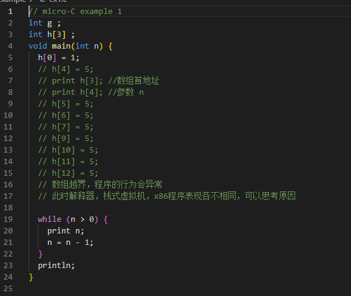
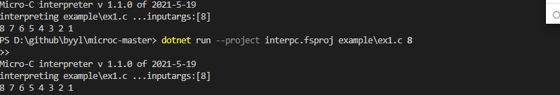
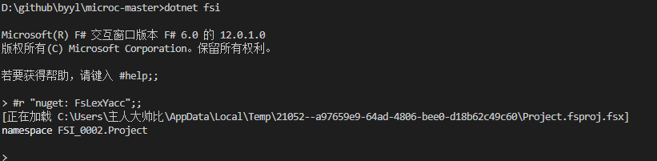
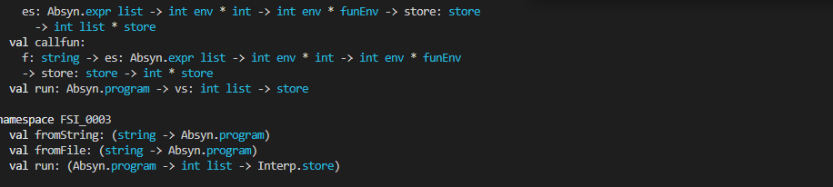
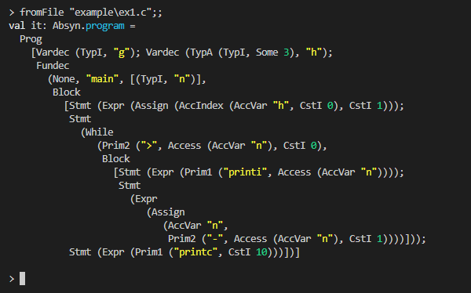
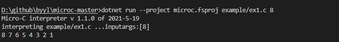
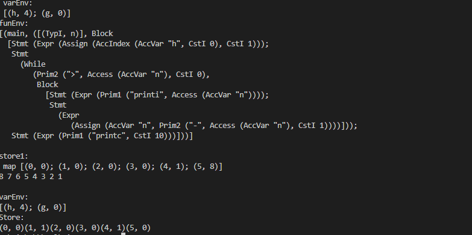
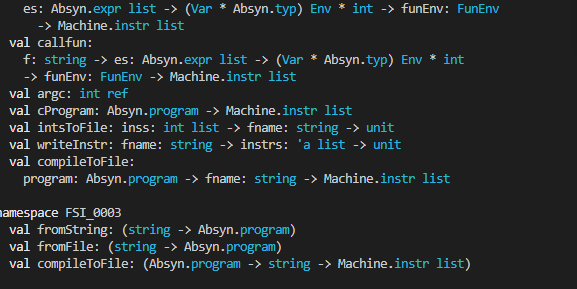
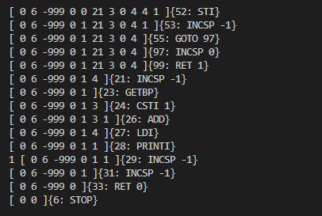

[2020-2021学年第2学期]

# [**实 验 报 告**]


- 课程名称:编程语言原理与编译
- 实验项目:期末大作业
- 专业班级__计算机1904
- 学生学号31901105 31901106_
- 学生姓名 池凯畅 丁枭波
- 实验指导教师:张芸

| 姓名   | 学号     | 班级       | 任务                                                         | 权重 |
| ------ | -------- | ---------- | ------------------------------------------------------------ | ---- |
| 池凯畅 | 31901105 | 计算机1904 | 解释器（主要）、编译器（一部分）、Java虚拟机（修改）、测试、文档 | 0.95 |
| 丁枭波 | 31901106 | 计算机1904 | 编译器（主要）、解释器（一部分)、Java虚拟机（修改）测试、文档、注释 | 0.95 |


## 项目说明

### interpreter  解释器

```sh
Absyn.fs micro-C abstract syntax                              抽象语法
grammar.txt informal micro-C grammar and parser specification 文法定义
CLex.fsl micro-C lexer specification                          fslex词法定义
CPar.fsy micro-C parser specification                         fsyacc语法定义
Parse.fs micro-C parser                                       语法解析器
Interp.fs micro-C interpreter                                 解释器
example/ex1.c-ex25.c micro-C example programs                 例子程序
interpc.fsproj                                                项目文件

```

### compiler  编译器

```sh
Machine.fs definition of micro-C stack machine instructions  VM 指令定义
Machine.java micro-C stack machine in Java                   VM 实现 java
machine.c micro-C stack machine in C                         VM 实现 c 
machine.cs micro-C stack machine in CSharp                   VM 实现 c#
machine.csproj  machine project file                         VM 项目文件

Comp.fs compile micro-C to stack machine code             编译器 输出 stack vm 指令序列
Backend.fs x86_64 backend                                 编译器后端 翻译 stack vm 指令序列到 x86_64
driver.c     runtime support                                 运行时支持程序
prog0 example stack machine program: print numbers           字节码 案例，输出数字
prog1 example stack machine program: loop 20m times          字节码 案例，循环2千万次
microc.fsproj                                                编译器项目文件
```

### compiler  优化编译器

```sh
Contcomp.fs compile micro-C backwards                   优化编译器
microcc.fsproj                                          优化编译器项目文件
```

## 构建

### A 解释器

####  构建 解释器 

```sh
# 编译解释器 interpc.exe 构建 
dotnet restore  interpc.fsproj   # 可选
dotnet clean  interpc.fsproj     # 可选
dotnet build -v n interpc.fsproj # 构建./bin/Debug/net5.0/interpc.exe ，-v n查看详细生成过程

# 执行解释器
./bin/Debug/net5.0/interpc.exe  example\ex1.c 8
dotnet run --project interpc.fsproj example\ex1.c 8
dotnet run --project interpc.fsproj -g example\ex1.c 8  //显示token AST 等调试信息

```






#### 运行解释器

```sh
# 生成扫描器
dotnet "C:\Users\gm\.nuget\packages\fslexyacc\10.2.0\build\/fslex/netcoreapp3.1\fslex.dll"  -o "CLex.fs" --module CLex --unicode CLex.fsl

# 生成分析器
dotnet "C:\Users\gm\.nuget\packages\fslexyacc\10.2.0\build\/fsyacc/netcoreapp3.1\fsyacc.dll"  -o "CPar.fs" --module CPar CPar.fsy

# 命令行运行程序
dotnet fsi 

#r "nuget: FsLexYacc";;  //添加包引用
#load "Absyn.fs" "Debug.fs" "CPar.fs" "CLex.fs" "Parse.fs" "Interp.fs" "ParseAndRun.fs" ;; 

open ParseAndRun;;    //导入模块 ParseAndRun
fromFile "example\ex1.c";;    //显示 ex1.c的语法树
run (fromFile "example\ex1.c") [17];; //解释执行 ex1.c
run (fromFile "example\ex11.c") [8];; //解释执行 ex11.c

Debug.debug <-  true  //打开调试

run (fromFile "example\ex1.c") [8];; //解释执行 ex1.c
run (fromFile "example\ex11.c") [8];; //解释执行 ex11.
#q;;

```









解释器的主入口 是 interp.fs 中的 run 函数，具体看代码的注释

### B 编译器

#### 构建microc编译器

```sh
# 构建 microc.exe 编译器程序 
dotnet restore  microc.fsproj # 可选
dotnet clean  microc.fsproj   # 可选
dotnet build  microc.fsproj   # 构建 ./bin/Debug/net5.0/microc.exe

dotnet run --project microc.fsproj example/ex1.c 8   # 执行编译器，编译 ex1.c，并输出  ex1.out 文件
dotnet run --project microc.fsproj -g example/ex1.c 8  # -g 查看调试信息

./bin/Debug/net5.0/microc.exe -g example/ex1.c  # 直接执行构建的.exe文件，同上效果

# dotnet built -t:ccrun microc.fsproj     # 编译并运行 example 目录下多个文件     **
# dotnet built -t:cclean microc.fsproj    # 清除生成的文件      **
# ```

#### B.2 dotnet fsi 中运行编译器

​```sh
# 启动fsi
dotnet fsi

# r "nuget: FsLexYacc";;

# load "Absyn.fs"  "CPar.fs" "CLex.fs" "Debug.fs" "Parse.fs" "Machine.fs" "Backend.fs" "Comp.fs" "ParseAndComp.fs";;   

# 运行编译器
open ParseAndComp;;
compileToFile (fromFile "example\ex1.c") "ex1";; 

Debug.debug <-  true   # 打开调试
compileToFile (fromFile "example\ex4.c") "ex4";; # 观察变量在环境上的分配
#q;;


# fsi 中运行
#time "on";;  // 打开时间跟踪

# 参考A. 中的命令 比较下解释执行解释执行 与 编译执行 ex11.c 的速度
```


### C 优化编译器

#### C.1   构建优化编译器 microcc.exe

```sh

dotnet restore  microcc.fsproj
dotnet clean  microcc.fsproj
dotnet build  microcc.fsproj           # 构建编译器

dotnet run --project microcc.fsproj example/ex11.c    # 执行编译器
./bin/Debug/net5.0/microcc.exe example/ex11.c  # 直接执行

```






#### C.2 dotnet fsi 中运行 backwards编译器  

```sh
dotnet fsi -r ./bin/Debug/net5.0/FsLexYacc.Runtime.dll Absyn.fs CPar.fs CLex.fs Parse.fs Machine.fs Contcomp.fs ParseAndContcomp.fs   

open ParseAndContcomp;;
contCompileToFile (fromFile "example\ex11.c") "ex11.out";;
#q;;
```




### D 虚拟机构建与运行

- 运行下面的命令 查看 fac 0 , fac 3 的栈帧
- 理解栈式虚拟机执行流程

#### D.1 dotnet

```sh
dotnet clean  machine.csproj
dotnet run --project machine.csproj example/ex9.out 3 # 运行虚拟机，执行 ex9.out 

./bin/Debug/net5.0/machine.exe example/ex9.out 3
./bin/Debug/net5.0/machine.exe -t example/ex9.out 0  // 运行虚拟机，执行 ex9.out ，-t 查看跟踪信息
./bin/Debug/net5.0/machine.exe -t example/ex9.out 3  // 运行虚拟机，执行 ex9.out ，-t 查看跟踪信息
```




#### D.2 C

```sh

# 虚拟机执行指令
machine.exe example/ex9.out 3

# 调试执行指令
machine.exe -trace example/ex9.out 0  # -trace  并查看跟踪信息
machine.exe -trace example/ex9.out 3

```

#### D.3 Java

```sh
javac Machine.java
java Machine example/ex9.out 3


java Machinetrace example/ex9.out 0
java Machinetrace example/ex9.out 3
```

#### E 编译到x86_64


#### 预备软件

```sh
#Linux
$sudo apt-get install build-essential nasm gcc

# Windows
# nasm 汇编器
https://www.nasm.us/pub/nasm/releasebuilds/2.15.05/win64/
# gcc 编译器
https://github.com/jmeubank/tdm-gcc/releases/download/v9.2.0-tdm-1/tdm-gcc-9.2.0.exe

```

#### 步骤

栈式虚拟机指令编译到x86_64，简单示例

分步构建

```sh

# 生成 ex1.asm 汇编码 nasm 格式
dotnet run --project microc.fsproj example/ex1.c
# 汇编生成目标文件
nasm -f win64 example/ex1.asm -o example/ex1.o   # win
# nasm -f elf64 ex1.asm -o ex1.o   # linux  
# 编译运行时文件
gcc -c driver.c
# 链接运行时，生成可执行程序
gcc -g -o example/ex1.exe driver.o example/ex1.o
# 执行
./example/ex1.exe 8 

```

单步构建

```sh
# 使用 build target 编译 ex1.c
# 可修改 microc.fsproj 编译其他案例文件

dotnet  build -t:ccrunx86 microc.fsproj

```
